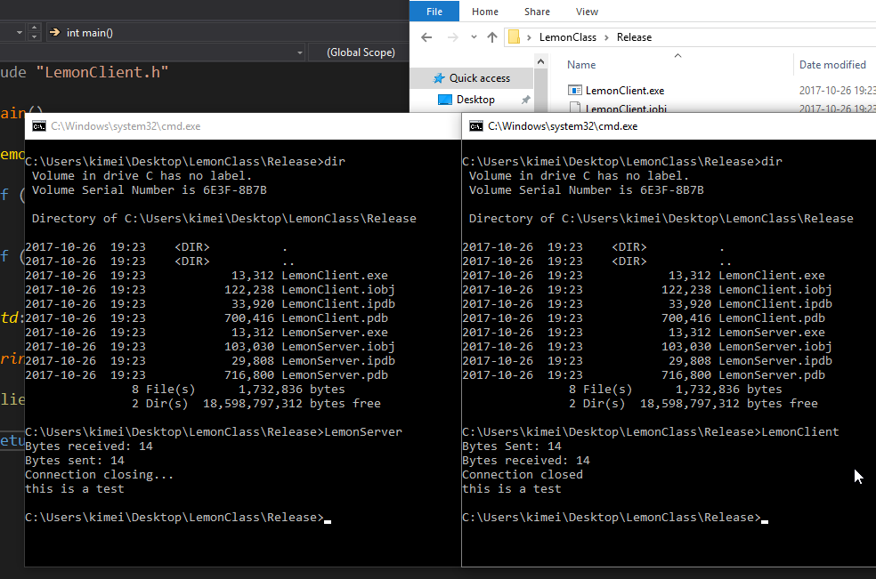

# LemonClass

I wanted to learn more about networking with C++ in mind, so I poked around MSDN and found documentation for Winsock. After playing with it I wanted to try make a wrapper class based from those examples. For simplisity I splitted this into two projects under the same solution to keep them separated. Server is listening for incoming connections and expects to receive a message from the client. And as soon it receives it it will send back the message to the client, then the server disconnect. When the client receives the message it will also disconnect.

Tags: C++, TCP Server & Client
